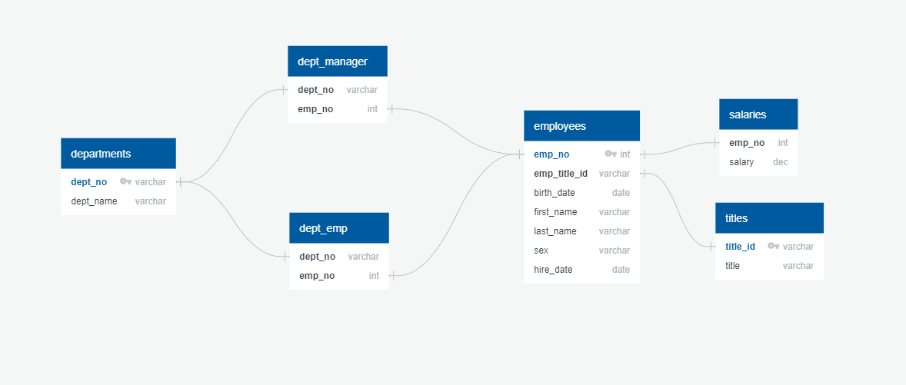

# sql-challenge

## Data Model

Project data model. This is an illustration of the logical schema set up.

## Data Engineering

Six schema tables were create:
1. departments
    - department id's
    - department name
2. titles
    - position title id's
    - position title names
3. employees
    - employee id's
    - employee position title id's
    - employee DOB
    - employee first name
    - employee last name
    - employee sex
    - employee hire date
4. dept_manager
    - deptartment id's
    - manager employee id's
5. salaries
    - employee id's
    - employee salary
6. dept_emp
    - employee id's
    - department id's
    

## Data Analysis

