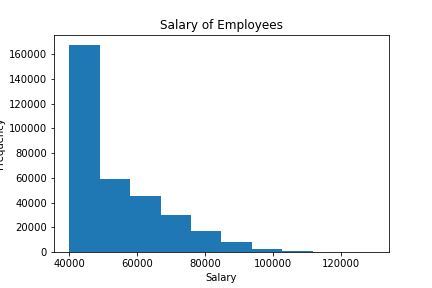
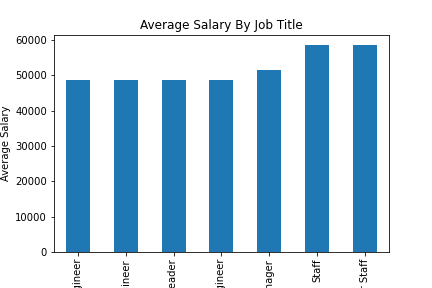

# sql-challenge

The following steps were completed using a free tool like [http://www.quickdatabasediagrams.com/](http://www.quickdatabasediagrams.com/) to model the database visually and Postgres to create the databases used.

## Data Model

Project data model. This is an illustration of the logical schema set up.

## Data Engineering

Six schema tables were create:
1. departments
    - department id's
    - department name
2. titles
    - position title id's
    - position title names
3. employees
    - employee id's
    - employee position title id's
    - employee DOB
    - employee first name
    - employee last name
    - employee sex
    - employee hire date
4. dept_manager
    - deptartment id's
    - manager employee id's
5. salaries
    - employee id's
    - employee salary
6. dept_emp
    - employee id's
    - department id's
    
The creation of these tables can be found in the [schema.txt](https://github.com/meielerol/sql-challenge/blob/main/schema.sql) file. The raw data tables can be found in the [data](https://github.com/meielerol/sql-challenge/tree/main/data) folder.

## Data Analysis

Each of the following is completed with the select functions just below their listed requirements. These can be seen in [query.sql](https://github.com/meielerol/sql-challenge/blob/main/query.sql) file.
1. List the following details of each employee: employee number, last name, first name, sex, and salary.
2. List first name, last name, and hire date for employees who were hired in 1986.
3. List the manager of each department with the following information: department number, department name, the manager's employee number, last name, first name.
4.List the department of each employee with the following information: employee number, last name, first name, and department name.
5. List first name, last name, and sex for employees whose first name is "Hercules" and last names begin with "B."
6. List all employees in the Sales department, including their employee number, last name, first name, and department name.
7. List all employees in the Sales and Development departments, including their employee number, last name, first name, and department name.
8. In descending order, list the frequency count of employee last names, i.e., how many employees share each last name.

## Bonus

At the company the average salary is $52,972.23, with a majority of employees making between $40K-$50K annually.

At the company the lowest average salary postion is Senior Engineer at $48,505.71 and the highest average salary is Senior Staff at $58,557.39.

## Epilogue

Some of the information for the epilogue info is as follows:
- employee id: 499942
- first name: April
- last name: Foolsday
- hire date: Februray 10th, 1997
- department: Development
- department id: d005
- title: Technique Leader
- salary: $40,000

The script for this info can be found in [epilogue.sql](https://github.com/meielerol/sql-challenge/blob/main/epilogue.sql).